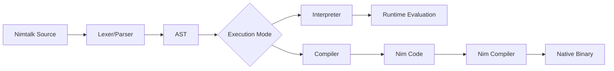

# Nimtalk

A modern Smalltalk dialect that plays nice with modern tooling, integrates seamlessly with the Nim ecosystem, and supports both AST interpretation and compilation to Nim code.

## Overview

Nimtalk is a prototype-based Smalltalk dialect designed for the modern era. It combines the elegance and simplicity of Smalltalk's object model with the performance and tooling of Nim. Nimtalk can be both interpreted for rapid development and compiled to efficient Nim code for production deployment.

## Goals

1. **Modern Smalltalk**: Bring Smalltalk's clean, message-passing object model to modern development workflows
2. **Nim Ecosystem Integration**: Leverage Nim's performance, metaprogramming, and extensive library ecosystem
3. **Dual Execution Model**: Support both AST interpretation (for REPL and rapid prototyping) and compilation to Nim (for production)
4. **Modern Tooling**: Work seamlessly with version control, editors, build systems, and other modern development tools
5. **Practical Persistence**: Integrate with BitBarrel for first-class persistent objects (inspired by Gemstone and original OODBs)
6. **The Smalltalk IDE experience**: Long term goal is to replicate some of the visual superb Smalltalk tooling like Browser, Explorer/Inspectors and Debugger.

## Features

### Language
- **Prototype-based object system** with dynamic inheritance
- **Message-passing semantics** with unary, binary, and keyword messages
- **Block closures** with lexical scoping and supporting early returns
- **Simple, consistent syntax** inspired by Smalltalk
- **Dynamic typing** with optional type annotations via Nim integration

### Execution Models
- **AST Interpreter**: Full Smalltalk semantics with dynamic evaluation
- **Nim Compiler**: Compile Nimtalk code to efficient Nim code
- **REPL**: Interactive development with immediate feedback, IDE a long term goal though

### Nim Integration
- **FFI Support**: Call Nim code directly from Nimtalk
- **Type Mapping**: Important work horse types like seq or Table from Nim adopted as core data structure types in Ntalk 
- **Type Marshaling**: Seamless conversion between Nimtalk objects and Nim types
- **Module System**: Import and use Nim modules as libraries
- **Performance**: Leverage Nim's native compilation for deployment

### Tooling
- **Command-line REPL** (`ntalk`) for interactive development
- **Build System**: Integration with Nimble and nims build scripts
- **Editor Support**: Syntax highlighting and tooling for modern editors
- **Testing Framework**: Integrated test runner with Nim's unittest

## Getting Started

### Installation

```bash
# Clone the repository
git clone https://github.com/yourusername/nimtalk.git
cd nimtalk

# Build the REPL
nimble build

# Install the binary (optional)
nimble install
```

### Quick Example

Create a file `hello.nt`:
```smalltalk
#!/usr/bin/env ntalk

# Create a calculator object
calculator := Object derive

# Add the two numbers as properties
calculator at: 'x' put: 3
calculator at: 'y' put: 4

# Get the result
calculator at: 'x'
```

Run it:
```bash
ntalk hello.nt
# or compile it
ntalk --compile hello.nt
```

### REPL Usage

```bash
$ ntalk
Nimtalk v0.1.0
> obj := Object derive
> obj at: 'value' put: 42
> obj at: 'value'
42
```

## Architecture

### AST Interpreter
The interpreter provides full dynamic evaluation:
- **Lexer**: Tokenizes Nimtalk source code
- **Parser**: Builds AST from tokens
- **Evaluator**: Executes AST with prototype object system
- **Object Model**: Dynamic objects with property bags and prototype chains

### Nim Compiler
The compiler transforms Nimtalk to Nim code:
- **Method Compilation**: Convert Smalltalk methods to Nim procedures
- **FFI Bridge**: Generate marshaling code for Nim type integration
- **Optimization**: Leverage Nim's optimizer for performance-critical code

### Dual-Mode Execution


## Language Syntax

### Basic Expressions
```smalltalk
# Literals
42
"hello world"
true
false

# Assignment
x := 42
obj := Object derive

# Message sends
Object clone
obj at: 'key'
obj at: 'key' put: 'value'
3 + 4
```

### Data Structure Literals

```smalltalk
# Array literals (ordered collections)
#(1 2 3)
#('apple' 'banana' 'cherry')

# Table literals (key-value dictionaries)
#{'key' -> 'value'}
#{'name' -> 'Alice' 'age' -> 30}

# Object literals (property bags)
{| name: 'Alice' age: 30 |}
{| x: 3 y: 4 |}
```

*Arrays map to Nim `seq[NodeValue]`, tables to `Table[string, NodeValue]`, and object literals create new `ProtoObject` instances.*

### Objects and Prototypes
```smalltalk
# Create prototype
Person := Object derive
Person at: 'name' put: 'Anonymous'
Person at: 'greet' put: [ 'Hello, ' + self at: 'name' ]

# Create instance
alice := Person derive
alice at: 'name' put: 'Alice'

# Send message
alice greet  # Returns 'Hello, Alice'
```

### Blocks and Control Flow
```smalltalk
# Block with parameter
[ :x | x * 2 ]

# Conditional
(x > 0) ifTrue: [ 'positive' ] ifElse: [ 'negative' ]

# Iteration
numbers do: [ :each | each print ]
```

## Differences from Standard Smalltalk

While Nimtalk draws inspiration from Smalltalk, there are several important differences:

### Literal Syntax Additions

Nimtalk extends Smalltalk's syntax with new literal forms for common data structures:

```smalltalk
# Arrays (equivalent to OrderedCollection)
#(1 2 3 4 5)

# Tables (equivalent to Dictionary)
#{'key' -> 'value' 'name' -> 'Alice'}

# Object literals (property bags, runtime-defined)
{| x: 3 y: 4 color: 'red' |}
```

### Standard Library Differences

Instead of traditional Smalltalk collections, Nimtalk uses Nim's data structures directly:

| Smalltalk | Nimtalk/Nim Equivalent |
|-----------|------------------------|
| `Array` | Not directly available (use `#()` array literals) |
| `OrderedCollection` | `seq` via `#()` literal syntax |
| `Dictionary` | `Table` via `#{}` literal syntax |
| `Set` | Uses Nim's `HashSet` |
| `Bag` | Not currently implemented |

This provides better performance and seamless integration with Nim code while maintaining familiar syntax.

### Prototype-Based vs Class-Based

**Standard Smalltalk** uses a class-based object system where objects are instances of classes that define their structure and behavior.

**Nimtalk** uses a prototype-based system:
- Objects are created by cloning existing objects
- No formal class definitions - prototypes serve as "live" classes
- Behavior is shared through the prototype chain (delegation)
- Objects can be extended at runtime by adding new properties

```smalltalk
# No class definition - just prototype-based derivation
Person := Object derive                      # Create a prototype
Person at: 'greet' put: [ 'Hello, ' + self at: 'name' ]

alice := Person derive                       # Create an instance
alice at: 'name' put: 'Alice'
alice greet                                  # => 'Hello, Alice'
```

### Instance Variables and Property Access

**Current State**: Nimtalk currently uses a property bag model where objects behave like JavaScript objects - you can add any property at any time via `at:put:`.

**Future Direction**: We plan to evolve toward a more traditional Smalltalk model where:
- Objects declare their instance variables explicitly
- Instance variable access is direct (like Smalltalk's instance variable syntax)
- The system enforces declared structure rather than allowing arbitrary property addition
- This provides better encapsulation and enables static optimizations

The property bag model offers flexibility during prototyping, but for production code, we want the clarity and safety of declared instance variables as in traditional Smalltalk.

### Method Syntax

Method definitions in Nimtalk follow Smalltalk conventions but are stored differently due to the prototype system:

```smalltalk
# Smalltalk: Methods are defined in class categories
# Nimtalk: Methods are stored as properties on prototypes
Person at: 'greet:' put: [ :name | 'Hello, ' + name ]
```

### Compilation Model

While standard Smalltalk implementations are typically purely interpreted (with optional JIT), Nimtalk offers:
- AST interpretation for development and REPL
- Compilation to Nim code for production deployment
- Direct access to Nim's optimizer and native compilation pipeline

See [SPECIFICATION.md](docs/SPECIFICATION.md) for detailed language specification.

## Nim Integration

### Calling Nim Code
```smalltalk
# Import Nim module
nimMath := Nim import: 'math'

# Call Nim function
result := nimMath sqrt: 25.0
```

### Type Conversion
```smalltalk
# Nimtalk to Nim
nimInt := 42 asNim: int
nimString := 'hello' asNim: string

# Nim to Nimtalk
talkObj := fromNim: nimObject
```

## Future Directions

### BitBarrel Integration
Planning to integrate [BitBarrel](../bitbarrel/) as a core persistence layer:
- **First-class barrels** as language objects
- **Transparent persistence** for Nimtalk objects
- **High-performance storage** with O(1) reads
- **Crash recovery** and background compaction

This would provide a powerful built-in persistence model similar to Gemstone and original OODBs.

### Language Features
- **Modules and namespaces**
- **Optional static type checking**
- **Concurrency model** (using Nim's threading)
- **Standard library** of collections and utilities

### Tooling
- **Language server** for IDE integration
- **Debugger** with Smalltalk-style inspectors
- **Package manager** for Nimtalk libraries
- **Web interface** for remote development

## Why Nimtalk?

### For Smalltalk Developers
- Familiar semantics with modern tooling
- Access to Nim's performance and ecosystem
- Production-ready compilation targets
- Integration with existing C/C++ libraries via Nim

### For Nim Developers
- Dynamic, interactive development experience
- Prototype-based object model
- REPL for exploration and debugging
- Gradual typing: start dynamic, add types as needed

### For Everyone
- **Simple**: Clean, consistent syntax
- **Practical**: Works with existing tools and workflows
- **Fast**: Native compilation via Nim backend
- **Integrable**: Bridges dynamic and static worlds

## Development Status

**Current**: Early prototype with basic interpreter and compiler skeleton
- ✅ Lexer and parser
- ✅ Prototype object system
- ✅ AST interpreter core
- ✅ Basic REPL
- ✅ Compiler infrastructure
- ✅ Test suite

**In Progress**:
- FFI integration with Nim
- Complete method compilation
- Standard library objects

**Planned**:
- BitBarrel persistence integration
- Performance optimization
- Enhanced tooling

## Contributing

Nimtalk is an Open Source project welcoming contributions. Areas of particular interest:
- Language design and semantics
- Nim integration features
- Performance optimization
- Tooling and editor support
- Documentation and examples

See [CONTRIBUTING.md](CONTRIBUTING.md) for development guidelines.

## License

MIT License - see [LICENSE](LICENSE) file for details.

## Acknowledgments

Inspired by:
- Smalltalk and its many implementations
- Nim's pragmatic meta-programming
- Gemstone's persistent object model
- Modern scripting languages and their tooling

---

*Nimtalk: Smalltalk feeling, Nim performance, modern tooling.*