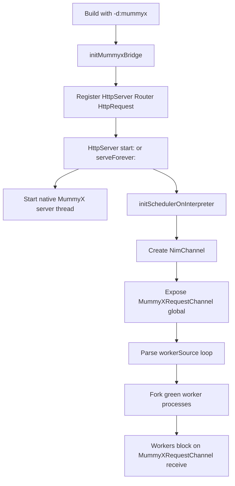
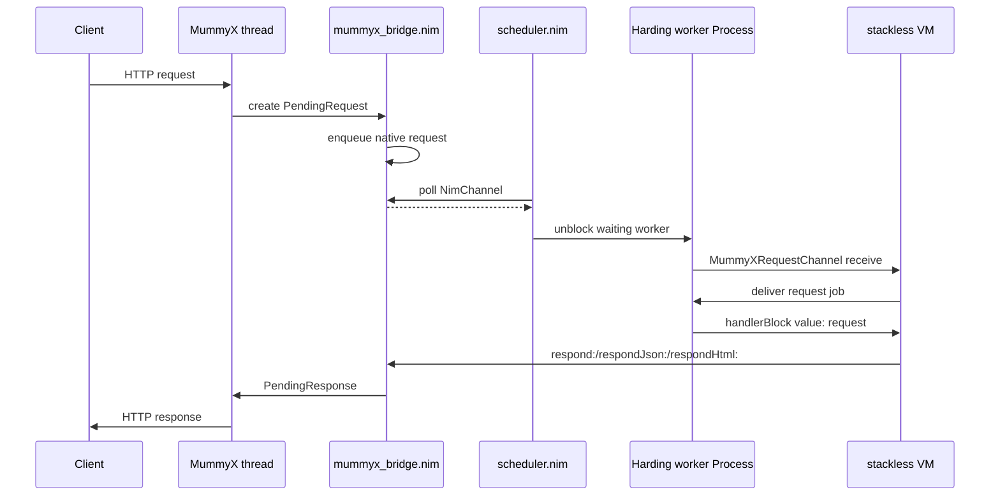

# MummyX Integration

Harding can be built with optional MummyX HTTP server support.

When enabled, Harding exposes `HttpServer`, `Router`, and `HttpRequest` through `lib/mummyx/Bootstrap.hrd`.

## What It Provides

- HTTP server routing from Harding code
- Request handlers written as Harding blocks
- Cooperative concurrency between multiple request handlers using Harding green processes
- Native socket handling on a MummyX thread, with Harding handler execution on the interpreter thread

This is concurrent request handling, not parallel Harding execution. Multiple requests can be in flight at once, but handler code still runs on one native interpreter thread.

## Build Commands

```bash
# REPL/interpreter with MummyX
nimble harding_mummyx

# Release build
nimble harding_mummyx_release

# Bona IDE with MummyX enabled
nimble bona_mummyx

# Release Bona build
nimble bona_mummyx_release
```

The MummyX-enabled binaries are still produced as `./harding` and `./bona`.

## Using It From Harding

Load the MummyX bootstrap library before creating a server:

```smalltalk
Harding load: "lib/mummyx/Bootstrap.hrd".

Server := HttpServer new.
Router := Router new.

Router get: "/" do: [:req |
  req respondHtml: "<h1>Hello</h1>"
].

Server router: Router.
Server serveForever: 8080.
```

Available server entry points:

- `HttpServer>>start:` - start server and return immediately
- `HttpServer>>start:address:` - start on a specific bind address
- `HttpServer>>processRequests` - run scheduler slices for pending requests
- `HttpServer>>serveForever:` - start server and run the request-processing loop
- `HttpServer>>stop` - stop the server

## Request Handling Model

- MummyX accepts the socket connection on a native thread.
- The request is forwarded into Harding through a native channel.
- A blocked Harding worker process wakes up, receives the request, and runs the matching route block.
- Handler blocks may call `Processor yield` to let other Harding request handlers run.

This means long-running handlers should yield periodically if you want other requests to make progress with low latency.

## How The Bridge Works

The bridge is split between `src/harding/web/mummyx_bridge.nim`, `src/harding/core/scheduler.nim`, and the normal stackless VM in `src/harding/interpreter/vm.nim`.

Startup flow:

- `initMummyxBridge` registers the native `HttpServer`, `Router`, and `HttpRequest` classes when Harding is built with `-d:mummyx`.
- `HttpServer>>start:` or `HttpServer>>serveForever:` starts the native MummyX server thread.
- Scheduler integration then creates a `NimChannel` and stores it in the Harding global `MummyXRequestChannel`.
- `scheduler.nim` also parses a small Harding worker loop (`workerSource`) and forks a pool of green worker processes that repeatedly receive jobs from that channel.



Request flow:

- The MummyX thread accepts a request and packages it as a native `PendingRequest`.
- `mummyx_bridge.nim` pushes that request into a native queue shared with the interpreter side.
- The scheduler polls active `NimChannel`s before each slice. When data is available, it unblocks one waiting worker process and delivers the job through `interp.nimChannelResult`.
- The worker process resumes its `MummyXRequestChannel receive`, gets a Harding array shaped like `#(request handlerBlock)`, and evaluates the handler block with the request as argument.
- The request object seen by Harding is a proxy `HttpRequest` instance backed by a Nim `RequestProxy`.
- When Harding code responds with `respond:body:`, `respondHtml:`, or `respondJson:`, the bridge sends a `PendingResponse` back to the MummyX thread, which writes the HTTP response to the socket.

Why `NimChannel` exists:

- The interpreter must stay single-threaded.
- MummyX still needs a native thread for socket I/O.
- `NimChannel` is the handoff point between those worlds: native code produces work, the green-process scheduler consumes it cooperatively.

Why the worker pool matters:

- Each HTTP request is handled by a Harding green process, not by the MummyX thread.
- If one handler calls `Processor yield` or blocks on another scheduler-aware primitive, another handler can continue.
- This gives cooperative concurrency between requests without running Harding bytecode or AST evaluation in parallel on multiple native threads.



## Example

See `examples/mummyx_hello.hrd`.

For the live-editable Bona Todo workflow, see `docs/BONA_WEB_TODO.md`.

It includes:

- `GET /`
- `GET /api/hello`
- `GET /api/greet/@name`
- `POST /api/echo`
- `GET /api/yield-work` for cooperative concurrency testing

Run it with:

```bash
./harding examples/mummyx_hello.hrd
```

## Quick Verification

```bash
curl http://127.0.0.1:8080/api/hello
curl http://127.0.0.1:8080/api/greet/World
curl -X POST -d test-body http://127.0.0.1:8080/api/echo
```

To observe cooperative overlap between Harding request handlers:

```bash
curl http://127.0.0.1:8080/api/yield-work &
curl http://127.0.0.1:8080/api/yield-work &
wait
```

The responses report `maxConcurrent`, which should rise above `1` when requests overlap.

You can also benchmark it with `wrk`:

```bash
wrk -t4 -c40 -d10s http://127.0.0.1:8080/api/yield-work
wrk -t4 -c40 -d10s http://127.0.0.1:8080/api/hello
```

`/api/hello` is the lightweight baseline. `/api/yield-work` intentionally burns interpreter time while yielding so you can see cooperative concurrency in action.
