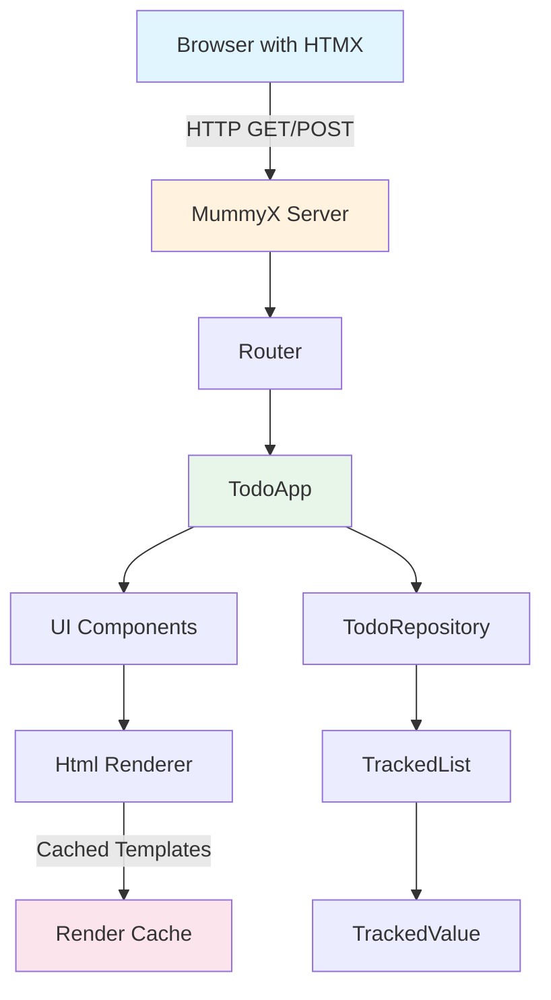
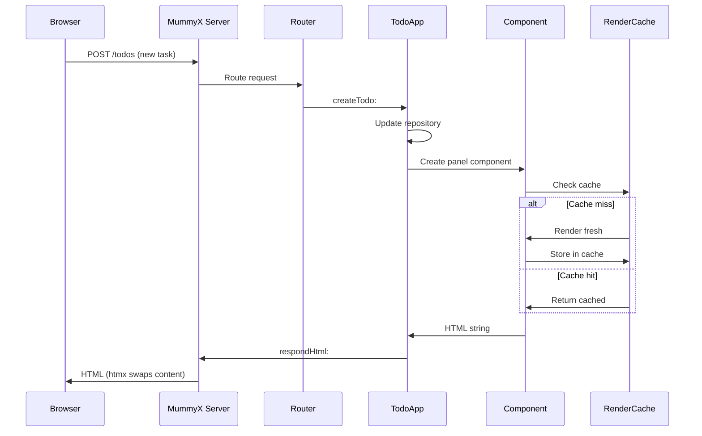
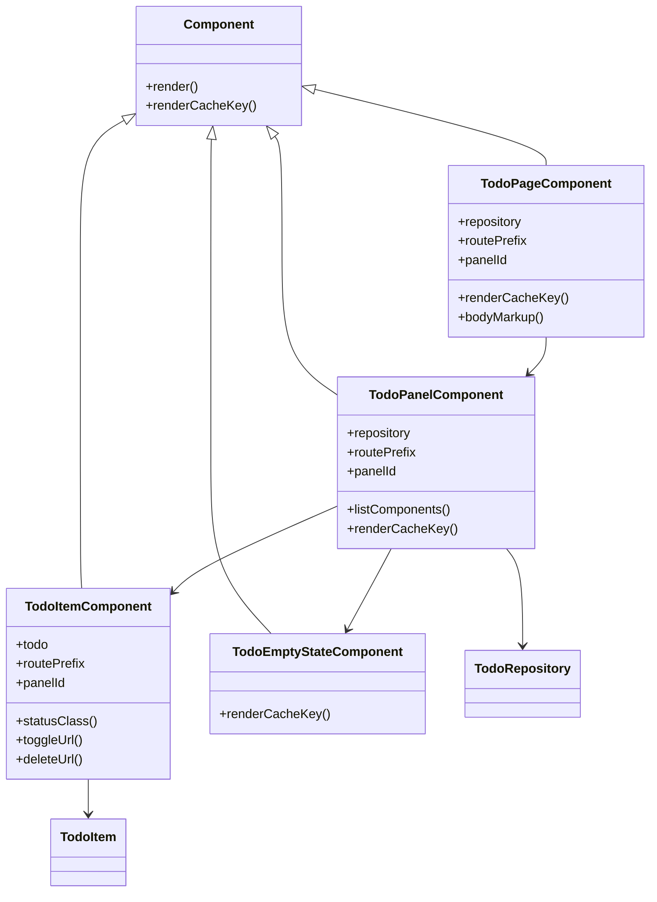
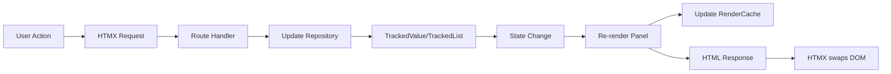
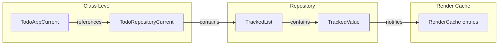

# Harding Todo App

A live-editable todo application demonstrating Harding's web capabilities with server-side rendering, HTMX for dynamic updates, and reactive state management.

## Quick Start

```harding
Harding load: "lib/mummyx/Bootstrap.hrd"
Harding load: "lib/web/Bootstrap.hrd"
Harding load: "lib/web/todo/Bootstrap.hrd"

TodoApp resetRepository
TodoApp serve
```

Then visit http://localhost:8080

## Architecture Overview



## Request Flow



## Component Hierarchy



## Data Flow



## Key Concepts

### 1. Server-Side Rendering with Html DSL

Components render HTML using Harding's Html DSL:

```harding
h div: [:card |
  card class: "card bg-base-100"
  card div: [:body |
    body class: "card-body"
    body h2: "Today"
  ]
]
```

### 2. HTMX for Dynamic Updates

The app uses HTMX attributes for progressive enhancement:
- `post:` - POST to server
- `target:` - Element to update
- `swap:` - How to update (outerHTML, innerHTML)

Example from TodoItemComponent:
```harding
button post: "/todos/1/toggle"
       target: "#todo-panel"
       swap: "outerHTML"
```

### 3. Render Caching

Each component has a `renderCacheKey` that identifies its cached output:

```harding
TodoItemComponent>>renderCacheKey [
  ^ "todo-item:" , (todo id printString) , ":" , panelId
]
```

The RenderCache stores rendered HTML and only re-renders when:
- Cache miss (first time or expired)
- Dependencies change (TrackedValue/TrackedList notify dependents)

### 4. Reactive State with TrackedValue

Todo items use TrackedValue for reactive properties:

```harding
TodoItem class>>id: title: completed: [
  item::titleState := TrackedValue value: aTitle
  item::completedState := TrackedValue value: aBool
]
```

When a todo is toggled:
1. `completedState value:` is called
2. TrackedValue notifies dependents
3. RenderCache entries that depend on this value are marked dirty
4. Next render re-renders the affected components

## File Structure

```
lib/web/todo/
├── Bootstrap.hrd              # Entry point - loads all files
├── README.md                  # This file
├── TodoApp.hrd               # Application controller & routes
├── TodoComponents.hrd        # UI components (Page, Panel, Item)
├── TodoItem.hrd              # Domain model for a single todo
└── TodoRepository.hrd        # Data access & business logic
```

## Routes

| Route | Method | Action |
|-------|--------|--------|
| `/` | GET | Full page render |
| `/todos/panel` | GET | Panel only (for HTMX) |
| `/todos/stats` | GET | Stats badges only (for HTMX) |
| `/todos` | POST | Create new todo |
| `/todos/:id/toggle` | POST | Toggle completion |
| `/todos/:id/delete` | POST | Delete todo |
| `/assets/daisyui.css` | GET | Stylesheet |

## State Management



## Development Tips

### Live Editing

One of Harding's strengths is live code editing:

1. Start the server with `TodoApp serve`
2. Open Bona IDE
3. Edit any component method (e.g., `TodoItemComponent>>renderCacheKey`)
4. Refresh browser - changes appear immediately!

The server keeps running while you edit - no restart needed.

### Reset State

During development, reset the repository to clear all todos:
```harding
TodoApp resetRepository
```

This also clears the RenderCache, so all components re-render fresh.

### Debug with Transcript

Add debugging output:
```harding
TodoApp>>createTodo: req [
  Transcript showCr: "Creating todo: " , (req formParam: "title")
  ...
]
```

## Dependencies

This app depends on:
- **lib/web/** - Html DSL, Component base class, RenderCache
- **lib/mummyx/** - HTTP server (MummyX)
- **lib/reactive/** - TrackedValue, TrackedList for reactive state

## MySQL Backend (optional)

To use MySQL for persistence instead of RAM:

1. Create a MySQL user and database:
```bash
sudo mysql -e "CREATE USER IF NOT EXISTS 'harding'@'127.0.0.1' IDENTIFIED BY 'harding123'"
sudo mysql -e "GRANT ALL PRIVILEGES ON *.* TO 'harding'@'127.0.0.1'"
sudo mysql -e "CREATE DATABASE IF NOT EXISTS todo_app"
sudo mysql -e "FLUSH PRIVILEGES"
```

2. Configure and start:
```harding
MySqlTodoRepository database: "todo_app"
MySqlTodoRepository user: "harding"
MySqlTodoRepository password: "harding123"
TodoApp useMySql: true
TodoApp serve
```

The MySQL backend will persist todos to the database, so they survive server restarts.

## How It All Works Together

1. **Initial Load**: User visits `/`, TodoPageComponent renders full page with TodoPanelComponent inside

2. **Add Todo**: User submits form → HTMX POSTs to `/todos` → `createTodo:` adds to repository → Panel re-renders with new item → HTMX swaps `#todo-panel` content

3. **Toggle**: User clicks "Mark done" → HTMX POSTs to `/todos/1/toggle` → `toggleTodo:` updates TrackedValue → Repository state changes → Panel re-renders → HTMX swaps content

4. **Caching**: First render of each component stores HTML in RenderCache. Subsequent renders check cache first. Changes to TrackedValue invalidate dependent cache entries.

## Why This Architecture?

- **Server-side rendering**: No client-side JS framework needed
- **HTMX**: Progressive enhancement, works without JavaScript (though better with it)
- **Render caching**: Fast response times even with complex UIs
- **Reactive state**: Automatic cache invalidation when data changes
- **Live editing**: Development workflow matches Smalltalk tradition
