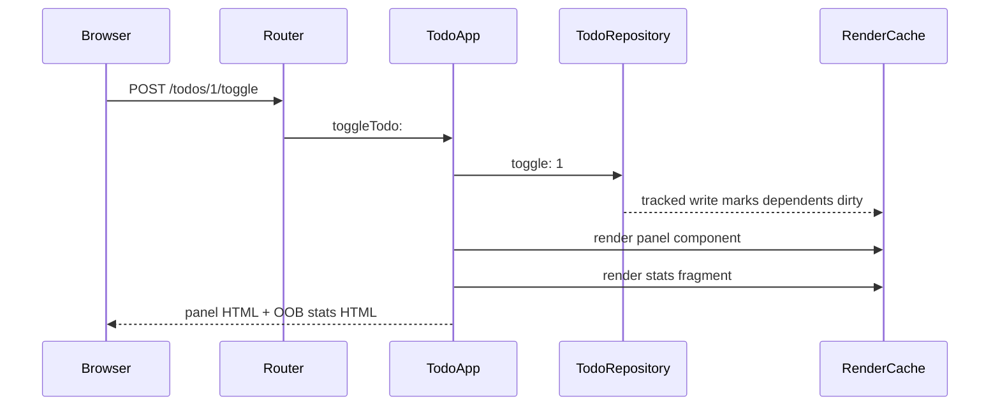
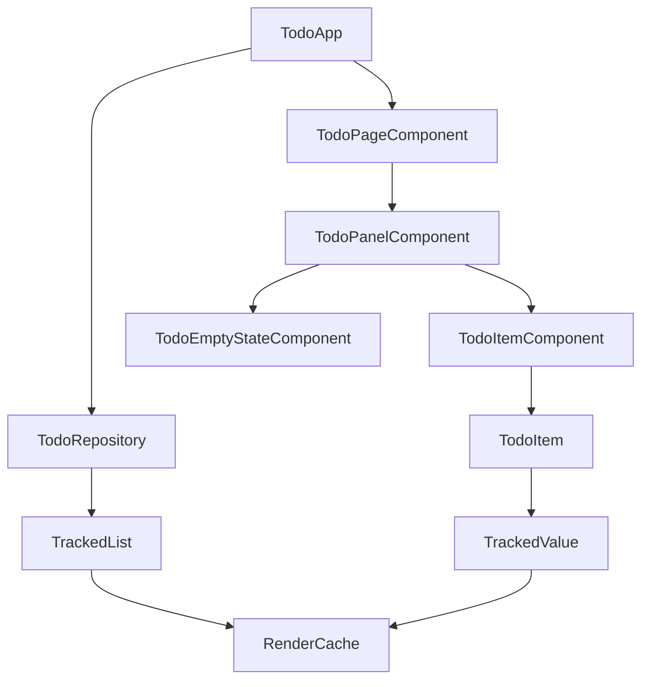
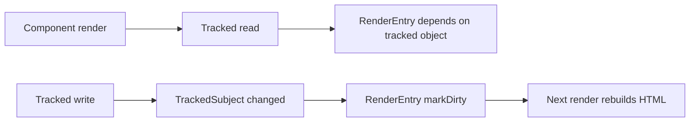

# Harding Todo

This example shows the current Harding web direction:

- plain `Html` DSL for markup
- tracked state in `lib/reactive/`
- cache entries owned by `Component` / `RenderCache`
- invalidation driven by tracked reads and writes
- HTMX fragment updates for interactivity

The app does not rely on the old Html template-hole approach anymore.

## Run It

Build a binary with MummyX support:

```bash
nimble harding_mummyx_release
```

Start the app:

```bash
./harding -e 'Harding load: "lib/mummyx/Bootstrap.hrd". Harding load: "lib/web/Bootstrap.hrd". Harding load: "lib/web/todo/Bootstrap.hrd". TodoApp resetRepository. TodoApp serveForeverOn: 8080.'
```

Then open `http://127.0.0.1:8080`.

## What Happens On A Request



## Structure



## File Layout

```text
lib/web/todo/
|- Bootstrap.hrd
|- README.md
|- TodoApp.hrd
|- TodoComponents.hrd
|- TodoItem.hrd
`- TodoRepository.hrd
```

## Current Flow

### 1. State

- `TodoRepository` owns a `TrackedList` of `TodoItem`s
- each `TodoItem` stores `title` and `completed` in `TrackedValue`s
- reads during rendering register dependencies automatically

### 2. Rendering

- each component provides a stable `renderCacheKey`
- `Component>>renderInto:` looks up the shared `RenderCache`
- if the entry is clean, cached HTML is reused
- if tracked state changed, the entry is marked dirty and re-rendered

### 3. HTMX updates

- the panel is the normal HTMX target
- mutating requests also return a stats fragment with `hx-swap-oob="true"`
- that updates the counters in place without a full page refresh

## Routes

| Route | Method | Purpose |
|---|---|---|
| `/` | GET | full page |
| `/todos/panel` | GET | panel fragment |
| `/todos` | POST | add todo |
| `/todos/:id/toggle` | POST | toggle completed |
| `/todos/:id/delete` | POST | delete todo |
| `/assets/daisyui.css` | GET | stylesheet |

## Cache Model



Important points:

- component instances are created per request
- cached HTML is shared in `RenderCache`, not stored on the component
- `renderCacheKey` identifies the fragment
- `renderSessionKey` can partition cache entries when output differs per session
- session-specific output should use `renderSessionKey`, not overloaded cache keys

## Why The Todo Example Matters

This example exercises the exact model we want:

- page-level cache reuse
- panel-level invalidation when the list changes
- item-level invalidation when a single todo changes
- no component tree persistence between requests
- no Html-specific dynamic placeholder machinery required in the app code

## Optional MySQL Backend

The app defaults to the in-memory repository.

If you explicitly enable MySQL through `TodoApp useMySql: true`, `TodoApp class>>repository` switches to `MySqlTodoRepository`.

That backend is optional and is not used by default.

## Notes For Future Cleanup

- `renderAuto` is still named after the older auto-key idea and could be renamed
- the old template-cache support in `lib/web/Html.hrd` should continue to be trimmed back now that component-level caching is the active path
