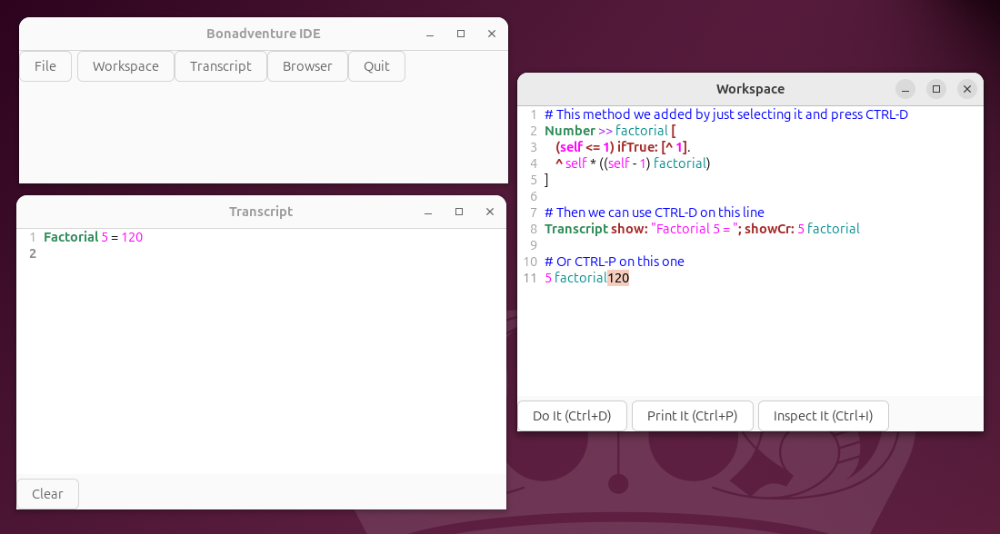

## Getting Started

### Installation

```bash
# Clone the repository
git clone https://github.com/gokr/harding.git
cd harding

# Build and put binaries in current directory
nimble harding

# Or install to ~/.local/bin
nimble install_harding
```

Requirements:
- Nim 2.2.6 or later

### Quick Start

```bash
# Interactive REPL
harding

# Run a script
harding script.hrd

# Evaluate an expression
harding -e "3 + 4"

# Show AST then execute
harding --ast script.hrd

# Debug output
harding --loglevel DEBUG script.hrd
```

### Granite Compiler

Compile to native binaries:

```bash
# Compile to standalone binary
granite compile myprogram.hrd -o myprogram

# Build with optimizations
granite build myprogram.hrd --release

# Run directly
granite run myprogram.hrd
```

## Learning Harding

### For Smalltalk Programmers

Start here if you know Smalltalk:

**What feels familiar:**
- Message syntax: unary `obj size`, binary `3 + 4`, keyword `dict at: key put: value`
- Cascade messages with `;`
- Block syntax and that they are proper lexical closures with non-local returns
- Everything is an object, everything happens via message sends
- Collection messages: `do:`, `select:`, `collect:`, `inject:into:`

**What's different:**
- Optional periods - newlines also separate statements
- Hash-with-space `# <- a space` for comments (not double quotes)
- Double quotes for strings (not single quotes)
- Class creation: `Point := Object derive: #(x y)`
- File-based, git-friendly source

Additional resources:
- **Key Differences** - [see below](#differences-from-smalltalk)
- [Smalltalk Compatibility Guide](https://github.com/gokr/harding/blob/main/docs/MANUAL.md#smalltalk-compatibility)
- [Syntax Quick Reference](https://github.com/gokr/harding/blob/main/docs/QUICKREF.md)

### For Newcomers

New to Smalltalk? Harding is a great way to learn:

1. Start with the [Language Manual](https://github.com/gokr/harding/blob/main/docs/MANUAL.md)
2. Try the [Examples](https://github.com/gokr/harding/tree/main/examples/)
3. Read the [Quick Reference](https://github.com/gokr/harding/blob/main/docs/QUICKREF.md)

### Example Code

Hello World:
```harding
"Hello, World!" println
```

Factorial:
```harding
# Extend Number with a factorial method
Number >> factorial [
    (self <= 1) ifTrue: [^ 1].
    ^ self * ((self - 1) factorial)
]

5 factorial println   # 120
10 factorial println  # 3628800
```

Counter Class:
```harding
| c |
Counter := Object derive: #(count)
Counter >> initialize [ count := 0 ]
Counter >> value [ ^count ]
Counter >> increment [ ^count := count + 1]


c := Counter new
c initialize
c increment
c value println   # 1
```

Exception Handling:
```harding
# Resumable exceptions
result := [
    10 // 0
] on: DivisionByZero do: [:ex |
    Transcript showCr: "Cannot divide by zero!".
    ex resume: 0  # Return 0 instead
].

result println   # 0
```

## Reference Documentation

### Language Reference

| Document | Description |
|----------|-------------|
| [Language Manual](https://github.com/gokr/harding/blob/main/docs/MANUAL.md) | Complete language specification |
| [Quick Reference](https://github.com/gokr/harding/blob/main/docs/QUICKREF.md) | Syntax cheat sheet |
| [Implementation Notes](https://github.com/gokr/harding/blob/main/docs/IMPLEMENTATION.md) | VM internals |

### Tools and Development

| Document | Description |
|----------|-------------|
| [Tools & Debugging](https://github.com/gokr/harding/blob/main/docs/TOOLS_AND_DEBUGGING.md) | CLI usage, debugging |
| [VSCode Extension](https://github.com/gokr/harding/blob/main/docs/VSCODE.md) | Editor support |
| [GTK Integration](https://github.com/gokr/harding/blob/main/docs/GTK.md) | GUI development |

### Project

| Document | Description |
|----------|-------------|
| [Future Plans](https://github.com/gokr/harding/blob/main/docs/FUTURE.md) | Roadmap |
| [Contributing](https://github.com/gokr/harding/blob/main/CONTRIBUTING.md) | Development guidelines |

## Differences from Smalltalk

### Syntax Changes

| Feature | Smalltalk | Harding |
|---------|-----------|---------|
| Comments | `"comment"` | `# comment` |
| Strings | `'string'` | `"string"` |
| Statement separator | Period `.` | Period or newline |
| Class creation | Class definition | `Object derive: #(vars)` |

### Semantic Changes

**No Metaclasses**
In Harding, classes are objects but there are no metaclasses:

```harding
# Instance method
Person >> greet [ ^ "Hello" ]

# Class method - defined on the class itself
Person class >> newPerson [ ^ self new ]
```

**Multiple Inheritance**
Harding supports multiple inheritance with conflict detection.

**nil as Object**
`nil` is an instance of `UndefinedObject`:

```harding
nil class     # UndefinedObject
nil isNil     # true
```

## VSCode Extension

Full IDE support for `.hrd` files:

```bash
nimble vsix    # Build the extension
code --install-extension harding-lang-*.vsix
```

Features:
- **Syntax highlighting** with TextMate grammar
- **Language Server Protocol (LSP)** - Completions, hover info, go to definition, document/workspace symbols
- **Debug Adapter Protocol (DAP)** - Breakpoints, stepping (over/into/out), call stack, variable inspection, watch expressions
- Comment toggling, bracket matching, code folding

## Bona GTK IDE

A graphical IDE written in Harding itself:

```bash
nimble bona    # Build the IDE
./bona         # Launch
```

Features:
- **Launcher** - Start tools and workflows from one place
- **Workspace** - Code editor with Do It / Print It / Inspect It
- **Transcript** - Output console

Next up: **System Browser** and **Inspector** (in progress), with a **Debugger** planned.



_Current Bona build with Launcher, Workspace, and Transcript. Browser and Inspector are next, with Debugger planned._

## Getting Help

- [GitHub Issues](https://github.com/gokr/harding/issues) - Bug reports
- [GitHub Discussions](https://github.com/gokr/harding/discussions) - Questions and ideas

## Contributing

See [CONTRIBUTING.md](https://github.com/gokr/harding/blob/main/CONTRIBUTING.md) for:
- Code style guidelines
- Build instructions
- Architecture overview
